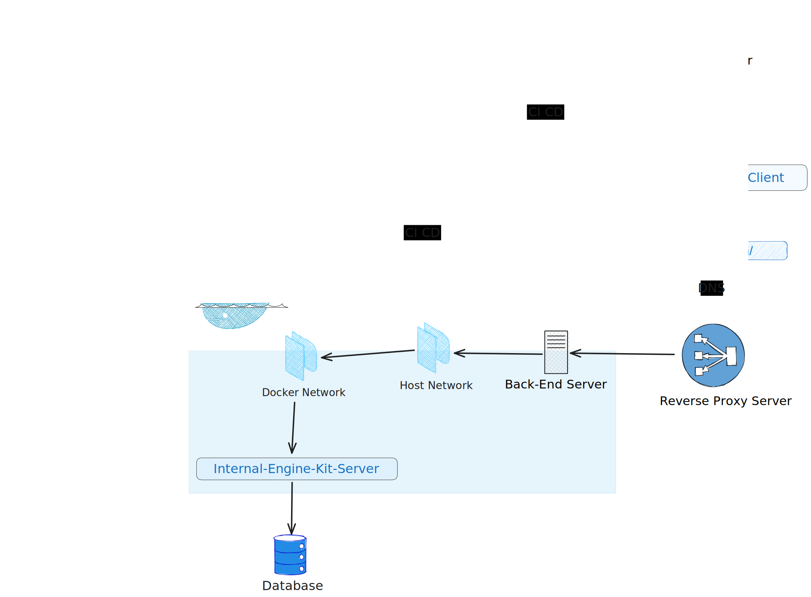
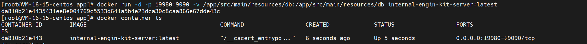

# Internal-Engine-Kit-Server

## Background

- Internal-engine-kit system was developed to focus on serving development teams by providing various features to
  enhance efficiency and support development processes.

## Overall Architecture Design

## Functional Show

- Locator
- Generator
- Convertor
- More extensions...

## System Architecture Design

- Design Driver / docs before code
- DDD (Domain-driven design)

### Front-End

- Quasar,Vue3
- Axios,Promise,SPA
- Components / Layer
- Unified Routes
- 

### API Design

- RESFul API / GET,POST,PUT,DELETE

### Back-End

#### Application

- SpringBoot3,JDK 17,Maven
- JPA,SQLite3
- Stream,Lambda
- Entity Class / Layer
- Unified Response
- 

#### Docker

- Build Image
- 

- Check Image
- 

- Container Run
- 

## Git Log

